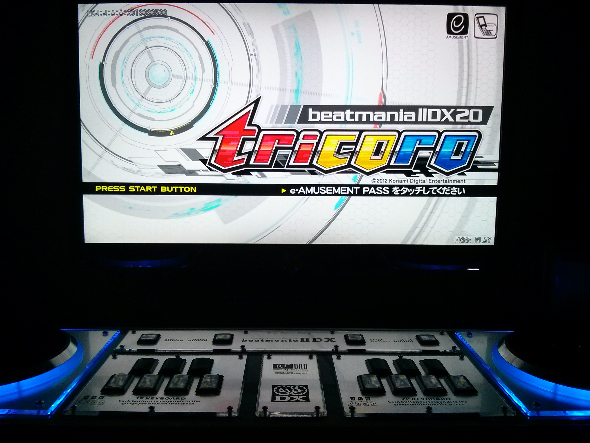

# The Road to 皆伝

 

- [Patterns, Techniques, Comments](./comments.md)

## Recent Accomplishments

- 2019-10-26: DP 7 All Normal Clear
- 2019-08-17: DP 8 All Played
- 2019-01-04: DP First 11 (冥 [H])
- 2018-06-22: Regain SP 八段
- 2018-06-10: DP 3 All Full Combo
- 2018-06-08: DP 七段

## Current Goals

- Regain SP 九段
- SP 10 All Normal Clear
- SP [8, 9] All Hard Clear
- SP [5, 6, 7] All Full Combo
- DP 八段
- DP 8 All Easy Clear
- DP 7 All Hard Clear
- DP [4, 5, 6] All Full Combo

## 段位認定

Rank | 1P | 2P | DP | 片手 1P | 片手 2P
:---:|:--:|:--:|:--:|:-------:|:-------:
皆伝 |
十段 |
九段 || 2016-02-04 |
八段 || 2014-01-30 |
七段 || 2014-06-02 | 2018-06-08 |
六段 || 2013-02-04 | 2013-12-13 |
五段 | 2018-06-10 | 2013-01-16 | 2013-08-31 |
四段 | 2013-12-01 | 2012-10-28 | 2013-05-24 |
三段 | 2013-12-01 | 2012-10-28 | 2013-05-14 |
二段 | 2013-12-01 | 2012-06-15 | 2013-02-11 |
初段 | 2013-12-01 | 2012-06-15 | 2013-01-14 | 2014-01-15 | 2013-10-05
一級 | 2013-12-01 | 2012-06-06 | 2012-12-26 | 2013-10-05 | 2013-10-05
二級 | 2013-12-01 | 2012-06-06 | 2012-12-26 | 2013-10-05 | 2013-10-05
三級 | 2013-12-01 | 2012-06-06 | 2012-12-26 | 2013-10-05 | 2013-10-05
四級 | 2013-12-01 | 2012-06-06 | 2012-12-24 | 2013-10-05 | 2013-10-05
五級 | 2013-12-01 | 2012-06-06 | 2012-12-24 | 2013-10-05 | 2013-10-05
六級 | 2013-12-01 | 2012-06-06 | n/a | 2013-10-05 | 2013-10-05
七級 | 2013-12-01 | 2012-06-06 | n/a | 2013-10-05 | 2013-10-05

## SP Clear Lamp

Lv | Played | Easy | Normal | Hard | Full Combo
:-:|:------:|:----:|:------:|:----:|:---------:
12 |
11 | 2015-02-14 |
10 | 2014-05-26 | 2016-02-03 |
9  | 2013-03-08 | 2013-08-30 | 2013-08-30 |
8  | 2013-01-06 | 2013-09-02 | 2014-01-17 |
7  | 2012-10-06 | 2013-02-12 | 2013-02-12 | 2013-12-07 |
6  | 2012-09-23 | 2013-01-07 | 2013-01-07 | 2013-03-17 |
5  | 2012-06-01 | 2012-06-08 | 2012-06-08 | 2013-01-14 |
4  | 2012-05-21 | 2012-06-15 | 2012-06-15 | 2012-12-01 | 2014-11-23
3  | 2011-11-13 | 2011-11-17 | 2011-11-17 | 2011-11-27 | 2013-08-18
2  | 2011-08-03 | 2011-08-03 | 2011-08-03 | 2011-08-03 | 2012-11-15
1  | 2011-06-19 | 2011-07-16 | 2011-07-16 | 2011-07-16 | 2012-11-12

## DP Clear Lamp

Lv | Played | Easy | Normal | Hard | Full Combo
:-:|:------:|:----:|:------:|:----:|:---------:
12 |
11 |
10 |
9  |
8  | 2019-08-17
7  | 2014-01-23 | 2014-06-21 | 2019-10-26 |
6  | 2013-02-22 | 2013-12-18 | 2013-12-18 | 2013-12-19 |
5  | 2013-01-24 | 2013-05-24 | 2013-05-24 | 2013-10-19 |
4  | 2012-12-25 | 2013-02-05 | 2013-02-05 | 2013-02-05 |
3  | 2012-12-22 | 2013-02-01 | 2013-02-01 | 2013-02-01 | 2018-06-10
2  | 2012-12-21 | 2012-12-21 | 2012-12-21 | 2013-01-24 | 2013-03-19
1  | 2012-12-21 | 2012-12-21 | 2012-12-21 | 2013-01-24 | 2013-01-24

## SP 1st New Level

Lv | Date | Song
:-:|:----:|:----
12 | 2015-10-03 | Innocent Walls [H]
11 | 2013-05-23 | Halfway of promise [A]
10 | 2013-02-05 | PHOTONGENIC [H]
9  | 2013-01-15 | quasar [H]
8  | 2012-06-23 | ЁVOLUTIΦN [H]

## DP 1st New Level

Lv | Date | Song
:-:|:----:|:----
12 |
11 | 2019-01-04 | 冥 [H]
10 | 2017-11-24 | 灼熱Beach Side Bunny [H]
9  | 2013-11-27 | MAX LOVE [H]
8  | 2013-09-15 | Survival Games [H]
7  | 2013-02-22 | Drive Me Crazy [H]

## Play Count

Count | Date | Note
:----:|:----:|:----
5,781 | 2015-03-08 | PW Closes
5,000 | 2014-09-05 |
4,000 | 2014-01-02 |
3,000 | 2013-09-07 |
2,000 | 2013-03-04 |
---   | 2013-01-10 | Made this repo
1     | 2012-12-21 | DP Game 1
1,000 | 2012-10-16 |
1     | 2011-06-19 | SP Game 1
